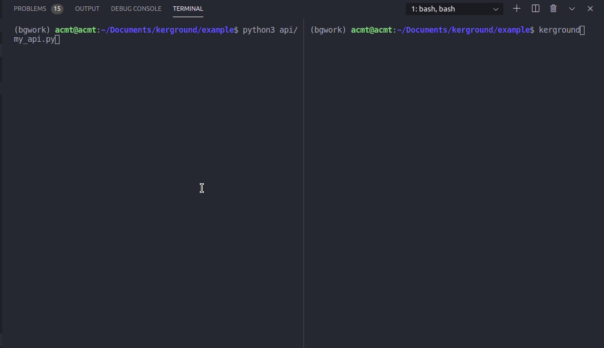

# kerground 
[](https://pepy.tech/project/kerground) [](https://pypi.org/project/kerground/)


Stupid simple background worker based on python.


## Quickstart

Install

```py
pip install kerground
```

Mark your file workers by naming them with `_worker.py` prefix

```py
my_worker.py
```

Kerground will look in `*_worker.py` and will consider each function an event. 
**Functions from `*_worker.py` files must be unique.**

Import `Kerground`, instantiate it and start sending events:

```py
#my_api.py

from kerground import Kerground

ker = Kerground()

@app.route('/some-task')
def long_wait():
    id = ker.send('long_task') 
    return {'id': id}

```

Event `long_task` is a function name from *_worker.py files
    

```py
#my_worker.py
import time

def long_task():
    # heavy workoad, more than a few seconds job
    time.sleep(2)
    
```


**Your api's and workers must be in the same package/directory**

```bash
root
├── api
│   ├── __init__.py
│   └── my_api.py
└── worker
    ├── __init__.py
    └── my_worker.py
```
You are free to use any folder structure. 


Open 2 cmd/terminal windows in the example directory:
- in one start your api `python3 api/my_api.py`
- in the other one type `kerground`




## API

### `ker.send('func_name', *func_args, timeout=None, purge=True)` 

Send event to kerground worker. `send` function will return the id of the task sent to the worker. 
You have **hot reload** on your workers by default! (as long you don't change function names)

- `timeout`: will show in kerground logs a warning if function takes longer than expected;
- `purge`  : if `True` when function is executed event will be deleted, if `False` event will be deleted after a `ker.get_response(id)` call.


### `ker.status(id)` 

Check status of a task with `status`. Kerground has the folowing statuses:
- pending  - event is added to kerground queue
- running  - event is running
- finished - event was executed succesfully
- failed   - event failed to be executed

Also you can check at any time the statuses of your tasks without specifing the id's:
```py
ker.pending() 
ker.running()
ker.finished()
ker.failed()
```
Or check all statuses with:
```py
ker.stats()
```


### `ker.get_response(id)`

Get the response from event (will be `None` if event didn't ran yet).

You can see functions collected from `*_worker.py` files with:
```py
ker.events
```

## Why

Under the hood kerground uses pickle for serialization of input/output data, a combination of `inspect` methods and built-in `getattr` function for dynamically calling the `"events"`(functions) from `*_worker.py` files. 
It's **resource frendly** (it doesn't use RAM to hold queue), **easy to use** (import kerground, mark your worker files with `_worker.py` prefix and you are set), **has hot reload for workers** (no need to restart workers each time you make a change) **works on multiple cores** (uses multiprocessing).


**Submit any questions/issues you have! Fell free to fork it and improve it!**