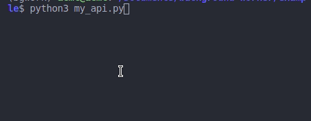
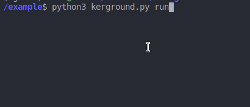
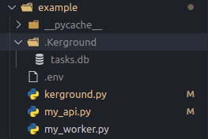
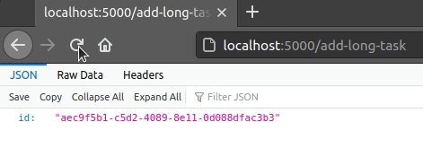
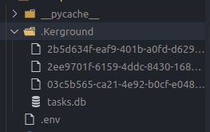
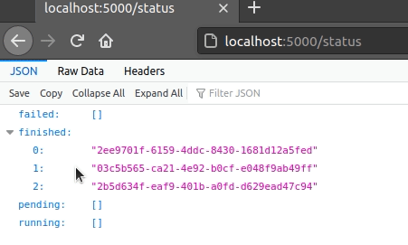

# kerground 
Simple background worker based on pickle and sqlite3.

## Quickstart
- TODO

In the `example` directory you have a minimal api setup with kerground background worker.

- cd in example folder and start the api 
- 

- start kerground background worker
- 

- you will see a `.Kerground` folder created with a sqlite db which will keep track of our background tasks statuses 
- 

- start sending tasks to kerground (you will see the id of that task returned)
- 

- in `.Kerground` folder you will see the tasks added
- 

- we can take a look at the statuses of the tasks send
- 


## How it works

Both the worker and the api must be on the same network. Other background workers use Redis/other for sending longer tasks to a background worker, but kerground uses just Python.

Add a `.env` file and specify a path where you want to hold `kerground` data. Similar to Redis based background workers which use an IP for connection we use a system path where both the worker and the api have access.

In `.env` file set `KERGROUND_STORAGE=".Kerground"`, `.Kerground` folder will be created if not present.


Mark your worker files with `_worker.py` suffix. Kerground will look in `*_worker.py` files and consider all functions events.

In your api files import kerground instance like this: 

```py
from kerground import ker

@app.route('/add-long-task')
def long_task_adder():
    # Start adding "events" in your views
    id = ker.send('long_task', *args) 
    return {'id': id}
```
Here we send the event `long_task` to the kerground backround worker.
`ker.send('long_task', *args)` - `long_task` is a function from our `*_worker.py` files.
For easy debugging you can import `long_task` function from your worker file. 

When you send an event you will receive back an `id` which you can use to check it's status.
```py
ker.status(id) # will return: pending | running | finished | failed
```
These will return a list of tasks with the requested status
```py
ker.pending() 
ker.running()
ker.finished()
ker.failed()
```

Also, you can get the response of that event(function)
```py
res = ker.get_response(id) # will return: Response | None if not finished yet | Traceback with the error got
```
**You have hot reload by default for your workers**, functions are called by their name with `getattr`. Only if you change the worker function name then you will need to restart kerground. You don't need to worry about RAM, kerground it's a file based background worker.


#TODO
- add timeouts
- add a cleanup feature
- add cron jobs
