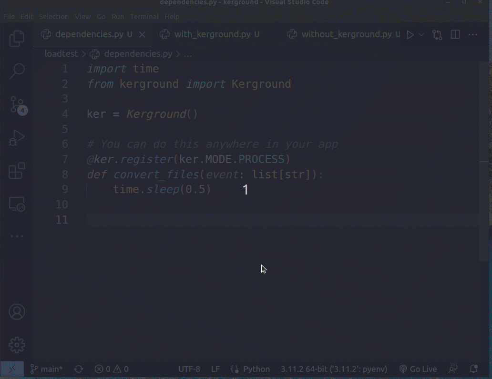

# kerground 
[](https://pepy.tech/project/kerground) [](https://pypi.org/project/kerground/)


Stupid simple background worker based on python. `Kerground` is super basic - no need for Redis/RabbitMQ. It does not utilize to much RAM because events are saved in plain old json files.


## Quickstart

Install

```py
pip install kerground
```

In your app folder create a new package called `dependencies` (you can add this in `utils` or whatever you consider fit otherwise)

```py
#app/dependencies/kerground.py
from kerground import Kerground

ker = Kerground()
```
You can set on `Kerground` the following params:
- `tasks_path` - path where the `events` will be saved by default in "./.kergroundtasks";
- `pool` - wait in seconds for pending tasks;

Next `register` your background workers like:
```py
#some_module_.py
from app.dependencies import ker

@ker.register(ker.MODE.THREAD, max_retries=3)
def convert_files(event: list[str]):
    pass # some heavy duty stuff here

# or just go with the defaults

@ker.register
def convert_files_v2(event: list[str]):
    pass # some heavy duty stuff here

```
#### **The `event` must be json serializable!** 

There are 3 mode available:
- `ker.MODE.THREAD` - distribute events with `threading.Thread` if you have urls to wait;
- `ker.MODE.PROCESS` - (**default**) distribute events with `multiprocessing.Process` if you have some CPU intensive tasks;
- `ker.MODE.SYNC` - distribute events one by one for the func to process;

By default `max_retries` is `0` you can increase this number if you need to get data from some urls and there is a posibility they will fail.

Now you can send an event to background worker (kerground) like:
```py
#some_other_module_possible_route_handler.py
from app.dependencies import ker

def send_files_for_conversion(files: List[UploadFile]):
    filepaths = [file.filename for file in files]
    msgid = ker.enqueue("convert_files", filepaths)
    return f"Files were sent for conversion with id: {msgid}"
```
Pass to `ker.enqueue` the function name you want to call in background along with the json parsable *args and **kwargs. Function `ker.enqueue` will return an id which you can later inspect for it's status with `ker.check_status(msgid)`.

Prepare the `worker.py` file:
```py
# ./worker.py
from app.dependencies import ker

if __name__ == "__main__":
    ker.listen()
```

You can check the `example` folder which was used for tests.

Difference with and without kerground:


# Dashboard

Kerground offers a small dashboard in which you can see the functions registered and their status count in a table.
To see the dashboard create a new file `worker_dashboard.py` and add the following code:
```py
#./worker_dashboard.py
from app.dependencies import ker

if __name__ == "__main__":
    ker.dashboard()
```
Go to `http://localhost:3030/` to see the dashboard.

The data used to fill the tasks table from the dashboard is taken by calling function: `ker.get_current_tasks()`.
You are free to create a custom endpoint in your choosed web framework and call that func.
More features will be added soon. 


**Submit any questions/issues you have! Fell free to fork it and improve it!**

